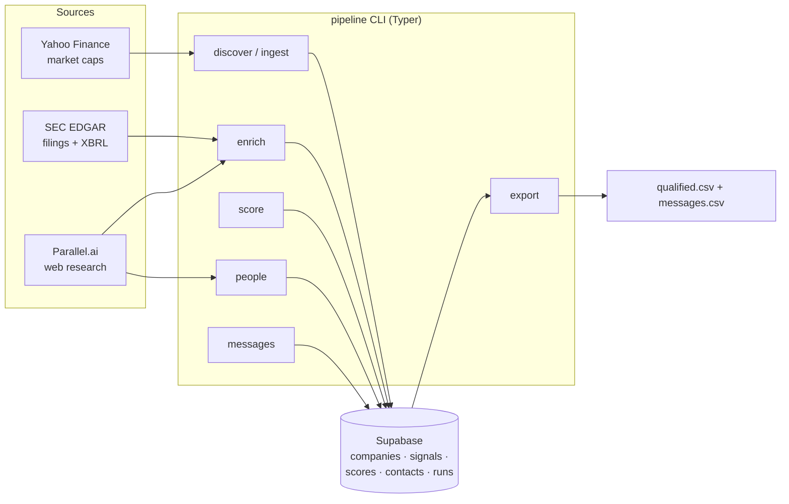

# AIPT — AI-Readiness Pipeline for Public Micro-Caps

AIPT finds US-listed micro-cap companies (Fintech, Edtech, Healthcare, SaaS) that show
public evidence they need AI services, scores that evidence with cited reasoning, and
surfaces decision-maker contacts — turning SEC filings and web research into a ranked,
exportable account list for [martechs.io](https://martechs.io).

Every company moves through a simple funnel:

```
new → enriched → scored → qualified | disqualified → contacts_found
```

- **new** — seeded from a universe screen (`discover`) or an explicit list (`ingest`)
- **enriched** — signals collected from SEC EDGAR (free) and Parallel.ai web research (paid)
- **scored** — deterministic base score + LLM reasoning; companies between the
  disqualify floor and qualify threshold stay here as the **human review band**
- **qualified / disqualified** — threshold decision (≥65 total AND ≥1 hard signal)
- **contacts_found** — decision-makers resolved for qualified accounts, ready to export

From `contacts_found`, the `messages` stage drafts a 4-step outreach sequence per
contact (built on each company's fresh outreach angles) — drafts only; no sending.

## Architecture at a glance



State lives in **Supabase** (six tables: `companies`, `signals`, `scores`, `angles`,
`contacts`, `messages`, plus `runs`). Everything else — EDGAR caches, scoring and
message queues, exports — is regenerable local state under `data/` (gitignored). See [docs/ARCHITECTURE.md](docs/ARCHITECTURE.md) for
the module map and design decisions.

## Quickstart

### Prerequisites

- Python 3.12+ and [uv](https://docs.astral.sh/uv/)
- A [Supabase](https://supabase.com) project (free tier works)
- Optional: a [Parallel.ai](https://parallel.ai) account for web-research signals and
  contact discovery (EDGAR-only enrichment works without it)

### Setup

```bash
git clone https://github.com/udaykang-byte/aipt-pipeline.git
cd aipt-pipeline
uv sync

cp .env.example .env        # then fill in the values — see comments in the file
```

Required in `.env`: `EDGAR_IDENTITY` (your name + email — the SEC requires it, no signup),
`SUPABASE_URL`, `SUPABASE_SERVICE_ROLE_KEY`. Optional: `SUPABASE_DB_URL` (lets the
pipeline apply the schema itself), `PARALLEL_API_KEY` (or `parallel-cli login`).

Apply the database schema once:

```bash
uv run python -m pipeline apply-schema      # needs SUPABASE_DB_URL
# — or paste sql/schema.sql into the Supabase SQL editor
```

### First run

```bash
uv run python -m pipeline ingest "TWLO"                     # seed one company
uv run python -m pipeline enrich --source edgar --limit 1   # collect free signals
uv run python -m pipeline status                            # see the funnel move
```

A single-company deep dive works even before ingesting:
`uv run python -m pipeline enrich --ticker XYZ --dry-run`.

## Commands

All commands run through `uv run python -m pipeline <command>`:

| Command | What it does |
|---------|--------------|
| `status` | Funnel counts per stage (`--brief` for one line) |
| `discover` | Screen the SEC universe for micro-cap sector matches and seed them |
| `ingest TICK1,TICK2` | Add specific companies (or `--csv file.csv` with a `ticker` column) |
| `enrich --source edgar\|parallel\|deep` | Collect signals (EDGAR free; parallel/deep are paid + capped) |
| `score --prepare` / `--commit` | Build scoring packets → commit verdicts + qualify |
| `people` | Find decision-makers for qualified accounts |
| `messages --prepare` / `--commit` | Draft per-contact outreach sequences (Haiku subagents + QA gate) |
| `export` | Write qualified accounts + contacts to `data/exports/qualified.csv` (`--messages` adds `messages.csv`) |
| `promote TICK1,TICK2` | Move review-band companies to qualified by hand |
| `prune` | Remove stale/out-of-scope companies (`--dry-run` first) |
| `apply-schema` | Apply `sql/schema.sql` to Supabase |

The normal cycle and troubleshooting notes live in [docs/PIPELINE.md](docs/PIPELINE.md).

## Signals and scoring

Enrichment looks for 15 signal types — 9 from SEC filings (E1–E9: new AI language in
10-Ks, leadership changes, restructuring programs, GTM inefficiency from XBRL
financials, missing tech leadership, recent IPOs…) and 6 from web research (P1–P6: AI
job postings, GTM hiring, AI announcements, product gaps vs competitors…). Every signal
carries evidence — a URL and a quote wherever possible.

Scoring sums weighted signals into four components:

```
total = intent(≤30) + capability_gap(≤25) + timing(≤25) + commercial_fit(≤20)
```

An LLM scorer reviews the deterministic base math and may deviate with justification.
**Qualify**: total ≥ 65 AND at least one hard signal. **Disqualify**: total < 45.
In between, the company stays in the review band for a human call.
v2 tightens the gate: qualified also requires at least one fresh, structured outreach angle
(funding event, leadership hire, or AI move) — see docs/SIGNALS.md.

Full detection logic and weights: [docs/SIGNALS.md](docs/SIGNALS.md) and
`config/settings.yaml`.

## Repository layout

```
src/pipeline/        # cli, db, models, universe, edgar_signals, parallel_signals,
                     # parallel_client, scoring, angles, funding_events, llm, people,
                     # messages
tests/               # pytest suite — fast unit tests, no network or DB needed
config/settings.yaml # universe band, sector→SIC map, weights, thresholds, caps
config/services.yaml # martechs.io service catalog (drives service-fit mapping)
config/outbound_copywriter.md  # copy framework the /outreach subagents follow
sql/schema.sql       # Supabase DDL
docs/                # runbook, signal taxonomy, architecture
data/                # gitignored: caches, scoring queue/results, exports
.claude/             # Claude Code setup: stage skills, hooks, permissions
```

## Costs and guardrails

- **EDGAR is free** — throttled to ≤8 req/s and cached under `data/cache/`.
- **Parallel.ai is paid** — every call path respects the per-run caps in
  `config/settings.yaml`. Use `--dry-run` before new batches.
- **LLM scoring and message drafting cost nothing in v1** — reasoning and copy run
  through Claude Code Haiku subagents. The OpenRouter provider in
  `src/pipeline/llm.py` is the v2 path.

## Contributing

The suite runs in under a second (`uv run pytest`) — keep it green. Conventions,
verification steps, and the PR flow are in [CONTRIBUTING.md](CONTRIBUTING.md).
If you use Claude Code, the repo ships with stage skills (`/status`, `/enrich`,
`/score`, …) that encode the correct orchestration for each pipeline stage.

---

Internal martechs.io project. Scope stops at drafted outreach sequences
(qualified accounts + contacts + per-contact message drafts) — no sending,
no CRM pushes (that's v2 sub-project 3).
