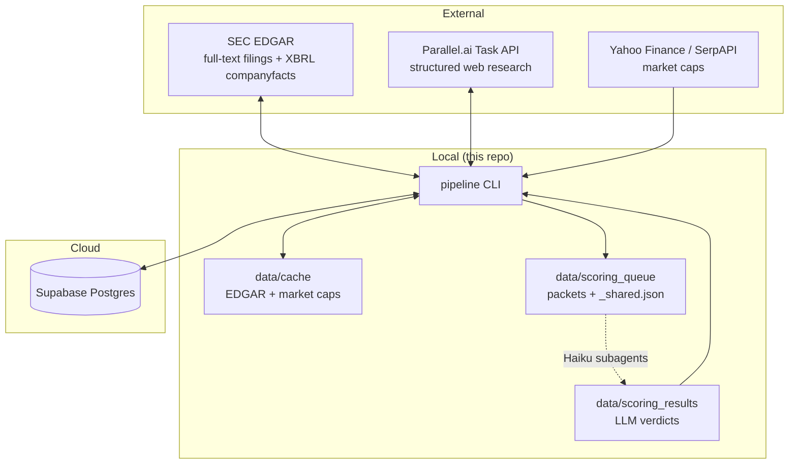

# Architecture

How the pieces fit together, what owns which state, and the design decisions
behind them. For day-to-day operation see [PIPELINE.md](PIPELINE.md); for signal
detection logic see [SIGNALS.md](SIGNALS.md).

## System context



Three kinds of state, three owners:

| State | Owner | Lifetime |
|-------|-------|----------|
| Company records, signals, scores, contacts, run history | Supabase (`companies`, `signals`, `scores`, `contacts`, `runs`) | Durable — the source of truth |
| Outreach angles (dated structured events) | Supabase (`angles`) | Durable — deduped by fingerprint, never bulk-wiped |
| Drafted outreach sequences | Supabase (`messages`) | Durable — upserted per (contact, angle); status tracks draft → sent |
| EDGAR responses, SIC crawl, market caps | `data/cache/` | Regenerable; safe to delete (first rebuild is slow) |
| Scoring packets and verdicts in flight | `data/scoring_queue/`, `data/scoring_results/`, archived to `data/scoring_archive/` | Per scoring run |
| Message packets and drafts in flight | `data/message_queue/`, `data/message_results/`, archived to `data/message_archive/` | Per message run |

## Module map

All code lives in `src/pipeline/` — one module per responsibility:

| Module | Responsibility |
|--------|----------------|
| `cli.py` | Typer entrypoint; every command, cap enforcement, run logging |
| `config.py` | Loads `.env` + the active profile pack's `settings.yaml` (`config/` default, `profiles/<name>/` overlay); single access point for configuration |
| `db.py` | All Supabase reads/writes; nothing else touches the database |
| `models.py` | Pydantic models: Company, Signal, ScoreVerdict, Contact |
| `universe.py` | SEC universe screen: exchange/SIC/market-cap filters, SPAC exclusion |
| `prescreen.py` | L1 pre-screen: pure `check()` shared by `ingest` and `universe.screen()` — cheap exclusions before any EDGAR/Parallel spend |
| `edgar_signals.py` | E1–E9 collectors over edgartools (10-K text, 8-K items, XBRL, DEF 14A) |
| `parallel_client.py` | Thin Parallel.ai Task API client: create, poll, parse |
| `parallel_signals.py` | P1–P6 collector: one structured research task per company |
| `scoring.py` | Deterministic base score, packet build (`_shared.json` + per-company), verdict validation, qualify/disqualify transitions |
| `llm.py` | Scoring providers: v1 packet contract for Haiku subagents, v2 OpenRouter |
| `angles.py` | Angle freshness/strength/fingerprints, deep-tier selection |
| `funding_events.py` | EDGAR funding-event collector → funding angles |
| `people.py` | Contact discovery for qualified accounts via Parallel |
| `messages.py` | Outreach drafting: per-contact packet build, deterministic copy QA gate, draft persistence |
| `outcomes.py` | Append-only outcome events (`message_events`) + monotonic status advancement for drafted messages |
| `analytics.py` | Outcome analytics: funnel conversion, time-in-stage, message attribution — pure computation, `render()` drives `status --analytics` |

Dependency direction is strictly inward: collectors, `people.py`, and
`messages.py` depend on `db.py`/`models.py`/`config.py`, never on each other.
`cli.py` is the only orchestrator.

## Stage-by-stage data flow

**discover / ingest** — `universe.py` screens SEC company data by exchange,
sector→SIC mapping, and market-cap band ($50M–$300M via yfinance, SerpAPI
fallback), excluding SPAC-shell name patterns. Matches are upserted as
`status=new`. `ingest` bypasses the screen — explicit tickers stay in even if
out of band.

**enrich** — per company, each collector produces `Signal` rows
(type, evidence URL, quote, observed date). Re-enriching replaces that source's
signals rather than appending, so runs are idempotent. EDGAR requests are
throttled (≤8/s), identity-stamped, and disk-cached; 8-K downloads are
pre-filtered by index item metadata so only relevant filings are fetched.
Parallel enrichment fans out one batch of structured tasks per run, capped by
`enrich.parallel.max_tasks_per_run`, and a single failed task doesn't sink the
batch. Company moves to `status=enriched`.

A deep tier (enrich --source deep) runs for companies at/near the qualify bar: one richer
Parallel task (capped by enrich.deep.max_tasks_per_run) plus a free EDGAR funding scan,
producing angle rows. The qualify gate (scoring) then requires ≥1 active angle.

**score** — two phases with a human/LLM step in between:

1. `score --prepare` computes the deterministic base score (capped signal-weight
   sums per component) and writes one slim packet per company into
   `data/scoring_queue/`, with the shared rubric/service-catalog/response-schema
   deduplicated into `_shared.json`.
2. LLM reasoning happens outside the pipeline process. In v1 the Claude Code
   `/score` skill spawns Haiku subagents that each read a packet + `_shared.json`
   and write a verdict JSON to `data/scoring_results/` — zero API cost. In v2 the
   same packets go through `llm.py`'s OpenRouter provider.
3. `score --commit` validates each verdict against the schema, writes it to
   `scores`, and applies thresholds: qualify at ≥65 with ≥1 hard signal,
   disqualify below 45, review band in between. Signal recency is enforced so
   stale signals can't drive a "why now" outreach thesis.

**people** — for qualified accounts only, one Parallel task per company resolves
decision-makers (roles chosen per matched service from `config/services.yaml`),
capped by `people.max_companies_per_run`. Company moves to `contacts_found`.

**messages** — v2 sub-project 2, same packet mechanism as scoring: `messages
--prepare` writes one packet per contact (company + contact + verdict + fresh
angles + role-matched service) to `data/message_queue/` with the copywriter
framework (`config/outbound_copywriter.md`) in `_shared.json`; the `/outreach`
skill's Haiku subagents write 4-step sequences; `messages --commit` runs a
deterministic QA gate (banned words, subject shape, placeholders, packet-fact
checks — hard failures stay queued for re-spawn) and upserts drafts into
`messages` keyed by (contact, angle). Companies without a fresh angle are
skipped. No status transition — coverage is derived, and per-sequence state
lives on `messages.status` (draft → approved/exported/sent in sub-project 3).

**export** — joins qualified companies with contacts into
`data/exports/qualified.csv`; `--messages` adds `data/exports/messages.csv`
(one row per sequence step). Generation is where v2 sub-project 2 stops — no
sending, no CRM push.

## Status machine

```
new → enriched → scored → qualified → contacts_found
                    │  └────→ disqualified
                    └─ (stays scored = human review band; `promote` overrides)
```

Transitions only happen in `scoring.py` (thresholds) and `cli.py`
(`promote`, `prune`). Nothing else writes `status`.

## Design decisions

- **Supabase as source of truth, local disk as cache.** Any laptop with `.env`
  can resume the pipeline; deleting `data/` loses nothing durable.
- **Free before paid.** EDGAR enrichment always runs before Parallel; Parallel
  and people calls are hard-capped per run in `config/settings.yaml`.
- **v1 scoring via Claude Code subagents.** Bulk LLM reasoning is routed through
  the `/score` skill (Haiku subagents) instead of paid APIs. The packet format
  is the stable contract, so v2 can flip to OpenRouter without touching
  collectors or the DB layer.
- **Evidence or it didn't happen.** Every signal stores a URL + quote; scoring
  verdicts must cite them. The qualify gate requires at least one *hard* signal
  (E1, E3, E4, E5, P1, P2, P3) so weak-soft-signal pileups can't qualify.
- **Human review band by design.** The gap between disqualify (<45) and qualify
  (≥65) is deliberate — borderline calls are a human decision (`promote`), and
  thresholds in `config/settings.yaml` are changed by people, not agents.
- **All DB access through `db.py`.** No ad-hoc SQL anywhere else; schema changes
  are edits to `sql/schema.sql` applied via `apply-schema`.
