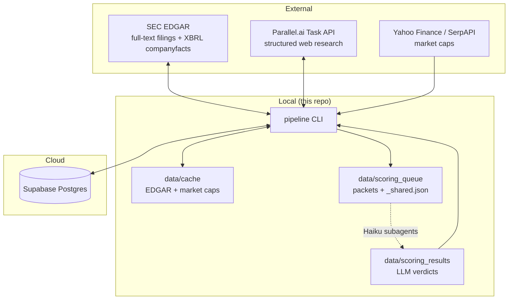

# Architecture

How the pieces fit together, what owns which state, and the design decisions
behind them. For day-to-day operation see [PIPELINE.md](PIPELINE.md); for signal
detection logic see [SIGNALS.md](SIGNALS.md).

## System context



Each kind of state has one owner:

| State | Owner | Lifetime |
|-------|-------|----------|
| Company records, signals, scores, contacts, run history | Supabase (`companies`, `signals`, `scores`, `contacts`, `runs`) | Durable — the source of truth |
| Outreach angles (dated structured events) | Supabase (`angles`) | Durable — deduped by fingerprint, never bulk-wiped |
| Drafted outreach sequences | Supabase (`messages`) | Durable — upserted per (contact, angle); status advances monotonically draft → … → meeting (or a terminal state) |
| Outcome events (sent/replied/meeting/…) | Supabase (`message_events`) | Durable — append-only audit trail; never updated or wiped |
| Active profile pack (ICP config) | `config/` (default) or `profiles/<name>/` overlay | Checked in — selected per invocation via `--profile` / `AIPT_PROFILE` |
| EDGAR responses, SIC crawl, market caps | `data/cache/` | Regenerable; safe to delete (first rebuild is slow) |
| Scoring packets and verdicts in flight | `data/scoring_queue/`, `data/scoring_results/`, archived to `data/scoring_archive/` | Per scoring run |
| Message packets and drafts in flight | `data/message_queue/`, `data/message_results/`, archived to `data/message_archive/` | Per message run |

## Module map

All code lives in `src/pipeline/` — one module per responsibility:

| Module | Responsibility |
|--------|----------------|
| `cli.py` | Typer entrypoint; every command, cap enforcement, run logging |
| `config.py` | Loads `.env` + the active profile pack's `settings.yaml` (`config/` default, `profiles/<name>/` overlay); single access point for configuration |
| `db.py` | All Supabase reads/writes; nothing else touches the database |
| `models.py` | Pydantic models: Company, Signal, ScoreVerdict, Contact |
| `universe.py` | SEC universe screen: exchange/SIC/market-cap filters, SPAC exclusion |
| `prescreen.py` | L1 pre-screen: pure `check()` shared by `ingest` and `universe.screen()` — cheap exclusions before any EDGAR/Parallel spend |
| `edgar_signals.py` | E1–E9 collectors over edgartools (10-K text, 8-K items, XBRL, DEF 14A) |
| `parallel_client.py` | Thin Parallel.ai Task API client: create, poll, parse |
| `parallel_signals.py` | P1–P6 collector: one structured research task per company |
| `scoring.py` | Deterministic base score, packet build (`_shared.json` + per-company), verdict validation, qualify/disqualify transitions |
| `llm.py` | Scoring providers: v1 packet contract for Haiku subagents, v2 OpenRouter |
| `angles.py` | Angle freshness/strength/fingerprints, deep-tier selection |
| `funding_events.py` | EDGAR funding-event collector → funding angles |
| `people.py` | Contact discovery for qualified accounts via Parallel |
| `messages.py` | Outreach drafting: per-contact packet build, deterministic copy QA gate, draft persistence |
| `outcomes.py` | Append-only outcome events (`message_events`) + monotonic status advancement for drafted messages |
| `analytics.py` | Outcome analytics: funnel conversion, time-in-stage, message attribution — pure computation, `render()` drives `status --analytics` |
| `calibrate.py` | Outcome → signal-weight report (`pipeline calibrate`): per-signal reply rates vs baseline with directional weight advice — report-only, never edits settings |

Dependency direction is strictly inward: collectors, `people.py`, and
`messages.py` depend on `db.py`/`models.py`/`config.py`, never on each other.
`cli.py` is the only orchestrator.

## Stage-by-stage data flow

**discover / ingest** — `universe.py` screens SEC company data by exchange,
sector→SIC mapping, and market-cap band ($50M–$300M via yfinance, SerpAPI
fallback), excluding SPAC-shell name patterns. Matches are upserted as
`status=new`. Both entry points also run the L1 prescreen (`prescreen.check`,
a pure function over the `prescreen:` settings block): excluded tickers/SIC,
shell names, OTC/blank exchange, disallowed exchange, cap band. `discover`
drops failing rows before seeding (reported as `prescreen_dq` in its stats);
`ingest` writes them as `status=disqualified` + `dq_reason` + `tier=T4` so
the decision is auditable — either way, nothing downstream ever spends an
EDGAR or Parallel call on them. `ingest` overrides only the sector filter
(out-of-sector tickers stay in); `ingest --force` is the sole prescreen
bypass.

**enrich** — per company, each collector produces `Signal` rows
(type, evidence URL, quote, observed date). Re-enriching replaces that source's
signals rather than appending, so runs are idempotent. EDGAR requests are
throttled (≤8/s), identity-stamped, and disk-cached; 8-K downloads are
pre-filtered by index item metadata so only relevant filings are fetched.
Parallel enrichment fans out one batch of structured tasks per run, capped by
`enrich.parallel.max_tasks_per_run`, and a single failed task doesn't sink the
batch. Company moves to `status=enriched`.

A deep tier (enrich --source deep) runs for companies at/near the qualify bar: one richer
Parallel task (capped by enrich.deep.max_tasks_per_run) plus a free EDGAR funding scan,
producing angle rows. The qualify gate (scoring) then requires ≥1 active angle.

**score** — two phases with a human/LLM step in between:

1. `score --prepare` computes the deterministic base score (capped signal-weight
   sums per component, plus a cross-component stacking bonus when evidence spans
   ≥N distinct components — base score only, never the LLM verdict) and writes
   one slim packet per company into `data/scoring_queue/`, with the shared
   rubric/service-catalog/response-schema deduplicated into `_shared.json`.
   Each packet signal carries `age_days`, a pre-decayed `effective_weight`, and
   an `urgency` bucket (hot/warm/cold by age) — informational context for the
   scorer and downstream outreach SLAs, never part of the deterministic math.
   A deterministic L2 pre-gate (`scoring.pre_gate`) then skips LLM scoring for
   companies whose verdict cannot change the qualify outcome — no hard signal,
   or base + `max_llm_lift` under the qualify threshold — by writing a synthetic
   verdict (capped base components, `model: deterministic/pre-gate`) straight to
   `data/scoring_results/`; `--prepare` prints them as `pre-gated N` and only
   returns the packets that still need a subagent.
2. LLM reasoning happens outside the pipeline process. In v1 the Claude Code
   `/score` skill spawns Haiku subagents that each read a packet + `_shared.json`
   and write a verdict JSON to `data/scoring_results/` — zero API cost. In v2 the
   same packets go through `llm.py`'s OpenRouter provider.
3. `score --commit` validates each verdict against the schema, writes it to
   `scores`, and applies thresholds: qualify at ≥65 with ≥1 hard signal,
   disqualify below 45, review band in between. Signal recency is enforced so
   stale signals can't drive a "why now" outreach thesis. Commit also computes —
   deterministically, never from the LLM — a tier (T1 ≥ `tiers.t1_min` and
   qualified; T2 qualified; T3 review; T4 disqualified) and a priority composite
   (verdict total + base stacking bonus + strongest fresh angle strength,
   weights in `scoring.priority`), written to both `scores` and `companies` so
   downstream ordering never needs a join.

**people** — for qualified accounts only, one Parallel task per company resolves
decision-makers, capped by `people.max_companies_per_run`. The candidate pool is
ordered `(tier asc, priority desc)` (`db.order_by_tier_priority`) before the cap
bites, so the strongest accounts get worked first. Roles come from the active
pack's `personas.yaml` services mapping when present (falling back to the flat
`people.roles_by_service` list — the default pack encodes both identically).
Company moves to `contacts_found`.

**messages** — v2 sub-project 2, same packet mechanism as scoring: `messages
--prepare` writes one packet per contact (company + contact + verdict + fresh
angles + role-matched service) to `data/message_queue/` with the copywriter
framework (the pack's `outbound_copywriter.md`) in `_shared.json`, working
companies in the same `(tier asc, priority desc)` order as people. Each packet
carries a `persona` block (pains/language/committee_role/seniority) when the
contact's role_bucket or title resolves against the pack's `personas.yaml`
(`people.match_persona`) — the copywriter speaks the recipient's language, not
just their title. Contacts with no
email and no LinkedIn URL are skipped (`no_channel`) before a packet is
written — no copywriter run for a sequence that can't be sent. Each packet
angle carries a one-line human-readable `summary`, and when colleagues at the
same company are being messaged on the same angle, a `diversity_note` tells
the copywriter to differentiate through this contact's lens. The `/outreach`
skill's Haiku subagents write 4-step sequences; `messages --commit` runs a
deterministic QA gate (banned words — canonical list in settings.yaml
`messages.banned_words` — subject shape, word counts per
`messages.word_count` (step 1: 50–90, hard max 125), any em dash, placeholders,
packet-fact checks — hard failures stay queued for re-spawn; warning-tier
checks ride on the row: a step-1 personalization score below
`messages.personalization_min`, dense paragraphs with 3+ sentences on one
line, you:we ratio) and upserts drafts into `messages` keyed by (contact,
angle). Companies without a fresh angle are skipped. No company-status transition —
coverage is derived, and per-sequence state lives on `messages.status`.

**export** — joins qualified companies with contacts into
`data/exports/qualified.csv`; `--messages` adds `data/exports/messages.csv`
(one row per sequence step, with `message_id` so outcomes can be recorded
against exported rows) plus `deliverability_checklist.md` (static sending
guidance + computed stats over the exported drafts). Generation is where the
pipeline stops — no sending, no CRM push.

**outcome / analytics** — after a sequence ships (outside the pipeline),
`pipeline outcome` records events via `outcomes.record()`: every event is
inserted into the append-only `message_events` table (the audit trail — never
updated, never wiped), and `messages.status` advances only when the monotonic
ladder allows (draft → approved → exported → sent → replied → positive_reply →
meeting; rejected/bounced/opted_out are terminal — enterable from anywhere,
never left). `analytics.py` is pure computation over those tables; its
`render()` drives `status --analytics` (funnel snapshot, time-in-stage from
`companies.status_changed_at`, sent→replied→positive→meeting rates with
benchmark bands, attribution by archetype/angle_family/service).

## Status machine

```
new → enriched → scored → qualified → contacts_found
  │                 │  └────→ disqualified
  │                 └─ (stays scored = human review band; `promote` overrides)
  └────→ disqualified (L1 prescreen at ingest: dq_reason set, tier=T4)
```

Transitions only happen in `scoring.py` (thresholds) and `cli.py`
(`promote`, `prune`, and the ingest-time prescreen write). Nothing else
writes `status`. Separately, `messages.status` has its own monotonic ladder
driven exclusively by `outcomes.record()` — see the outcome stage above.

## Design decisions

- **Supabase as source of truth, local disk as cache.** Any laptop with `.env`
  can resume the pipeline; deleting `data/` loses nothing durable.
- **Profile packs are per-file directory overlays, activated in place.**
  `config/` is the default pack; `profiles/<name>/` replaces whole files, never
  merges keys. `config.activate_profile()` (run by the CLI callback before any
  command) mutates the module-level `SETTINGS`/`SERVICES`/`PERSONAS` dicts
  in place rather than rebinding them — every module holds a reference to the
  same objects via `from pipeline.config import SETTINGS`, so a rebind would
  silently leave them on the old pack. Vendor identity lives entirely in the
  pack: sector vocabulary is free text (no enum), weights/thresholds/personas/
  voice are all data.
- **Free before paid — and prescreen before free.** The L1 prescreen
  (`prescreen.check`, pure function, no I/O) rejects hard disqualifiers at
  ingest/discover before even a cached EDGAR request; EDGAR enrichment always
  runs before Parallel; Parallel and people calls are hard-capped per run in
  the pack's `settings.yaml`.
- **v1 scoring via Claude Code subagents.** Bulk LLM reasoning is routed through
  the `/score` skill (Haiku subagents) instead of paid APIs. The packet format
  is the stable contract, so v2 can flip to OpenRouter without touching
  collectors or the DB layer.
- **Evidence or it didn't happen.** Every signal stores a URL + quote; scoring
  verdicts must cite them. The qualify gate requires at least one *hard* signal
  (E1, E3, E4, E5, P1, P2, P3) so weak-soft-signal pileups can't qualify.
- **Human review band by design.** The gap between disqualify (<45) and qualify
  (≥65) is deliberate — borderline calls are a human decision (`promote`), and
  thresholds in `config/settings.yaml` are changed by people, not agents.
- **Tier and priority are deterministic, computed at commit.** The LLM never
  outputs a tier — `scoring.tier_of()` and `scoring.priority_score()` run at
  `score --commit` from the verdict total, gate bucket, stacking bonus, and
  angle strength, and are mirrored onto `companies` so `/people` and
  `messages --prepare` can order work without joining `scores`.
- **Outcomes: append-only events, monotonic status.** `message_events` is an
  audit trail — every recorded event is inserted, even no-ops; rows are never
  updated or deleted. The single current `messages.status` only moves forward
  on a fixed ladder (`outcomes.next_status()`, a pure function), so a late or
  duplicate event can never regress a message, and terminal states
  (rejected/bounced/opted_out) are never left. Analytics derives everything
  else from the event log.
- **All DB access through `db.py`.** No ad-hoc SQL anywhere else; schema changes
  are edits to `sql/schema.sql` applied via `apply-schema`.
